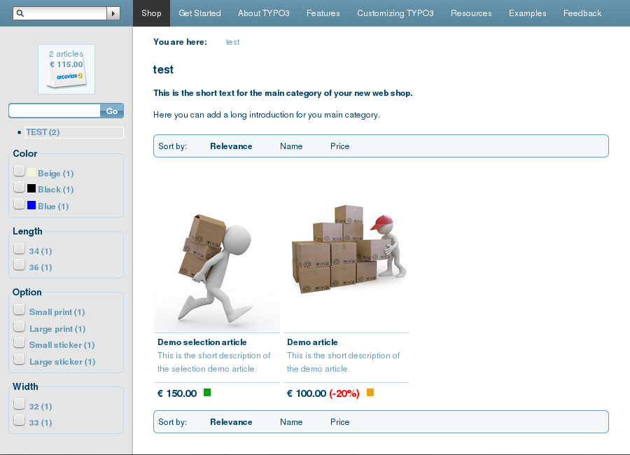
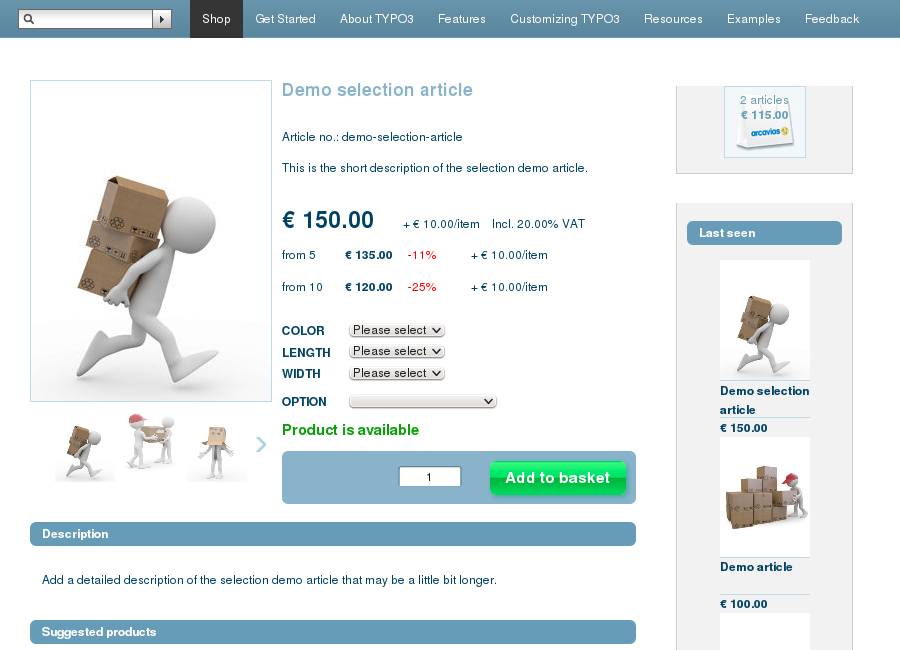

.. ==================================================
.. FOR YOUR INFORMATION
.. --------------------------------------------------
.. -*- coding: utf-8 -*- with BOM.

.. include:: ../Includes.txt

.. _introduction:

Introduction
============

.. _what-it-does:

What does it do?
----------------

The Arcavias TYPO3 extension is a high performance web shop based on the Arcavias e-commerce
framework. It integrates natively into TYPO3, uses the TYPO3 infrastructure and is fully
configurable via TypoScript.

Arcavias can efficiently handle 100 000+ products in a standard MySQL database with response
times around one second using the TYPO3 infrastructure including RealURL. For optimal
performance you need to install APC, the PHP byte code cache.

- `Full documentation <https://docs.arcavias.com/>`_
- `Stable versions <http://typo3.org/extensions/repository/view/arcavias>`_
- `Source code <https://github.com/Arcavias/arcavias-typo3/>`_
- `Roadmap <http://www.arcavias.com/en/project/roadmap.html>`_

.. _screenshots:

Screenshots
-----------

		Arcavias product list view

		This is the product list view after installing the Arcavias TYPO3 extension, setting
		up the database and importing the page tree.

		Arcavias product detail view

		This is the product detail view of the selection demo product.
		